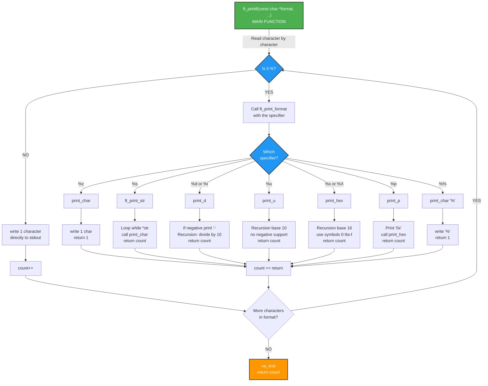

*This project has been created as part of the 42 curriculum by mirelsan*

## Description

**ft_printf** is a simplified reimplementation of the standard C library's `printf` function. The goal of this project is to understand how variadic functions work and to practice creating flexible, parameter-aware functions that can handle different data types at runtime.

The project implements a subset of `printf` functionality, supporting the most commonly used format specifiers: characters, strings, integers, unsigned integers, hexadecimal numbers (both lowercase and uppercase), pointers, and literal percent signs.

## Instructions

### Compilation

To compile the library:

```bash
make
```

This will create a static library file named `libftprintf.a` that can be linked into other projects.

To clean object files:

```bash
make clean
```

To remove all generated files:

```bash
make fclean
```

To recompile from scratch:

```bash
make re
```

### Linking

To use this library in your project, include the header file and link against the library:

```bash
gcc -Wall -Wextra -Werror your_program.c -L. -lftprintf -o your_program
```

### Supported Format Specifiers

- `%c` - Character
- `%s` - String
- `%d` - Decimal integer
- `%i` - Integer
- `%u` - Unsigned integer
- `%x` - Hexadecimal (lowercase)
- `%X` - Hexadecimal (uppercase)
- `%p` - Pointer address
- `%%` - Literal percent sign

## Function Flow Diagram

This diagram shows how all functions are connected and how the program flows:



## Algorithm and Data Structure Analysis

### Main Approach: Variadic Functions

The core of this implementation relies on **variadic functions**, which allow functions to accept a variable number of arguments of different types. This is achieved using:

- **`va_list`**: A type that holds the state of variable arguments
- **`va_start()`**: Initializes the argument list
- **`va_arg()`**: Retrieves the next argument from the list
- **`va_end()`**: Cleans up the argument list

### Processing Flow

1. **Format String Parsing** (`ft_printf.c`):
   - The main function iterates through the format string character by character
   - When a `%` is encountered, it triggers the format specifier handler
   - Non-format characters are directly written to stdout

2. **Format Specifier Dispatch** (`ft_print_format.c`):
   - Uses a series of conditional checks to identify the specifier type (Guard Pattern)
   - Extracts the corresponding argument from the variadic list using `va_arg()`
   - Calls the appropriate handler function for that data type
   - Accumulates the return value of each handler to track total characters printed

3. **Number Base Conversion** (Recursive Approach):

   **For Decimal Numbers** (`print_d.c`):
   - Handles negative numbers by separating the sign and converting the absolute value
   - Uses **recursive division** to extract digits from least significant to most significant
   - Each recursive call processes `n / 10`, and the base case prints `n % 10 + '0'`
   - Time complexity: O(log₁₀ n), where n is the number value
   - Space complexity: O(log₁₀ n) for recursion stack

   **For Hexadecimal Numbers** (`print_hex.c`):
   - Similar recursive approach but with base 16 instead of 10
   - Maintains two symbol tables: `"0123456789abcdef"` and `"0123456789ABCDEF"`
   - Each recursive call processes `n / 16` and uses `n % 16` to index into the symbol table
   - Time complexity: O(log₁₆ n)
   - Space complexity: O(log₁₆ n) for recursion stack

4. **Return Value Tracking**:
   - Every function returns the number of characters written
   - The main function accumulates these counts to return the total output length
   - This ensures `ft_printf` returns the exact same value as the standard `printf`

### Why Recursion for Base Conversion?

Recursion was chosen for number-to-string conversion because:
- **Natural Reversal**: Automatically reverses digit order (from least to most significant)
- **Simplicity**: Avoids buffer allocation or string reversal logic
- **Efficiency**: Minimal overhead for reasonable number sizes (typical printf use cases)
- **Elegance**: Clean and maintainable code structure

### Edge Cases Handled

- **Negative integers**: Sign handling in `print_d()` with recursive processing
- **NULL pointers**: Proper handling in `print_p()` function
- **Unsigned integers**: Correct casting and conversion avoiding overflow
- **Empty strings**: Safe NULL pointer checking in `ft_print_str()`
- **Percent literal**: `%%` correctly prints a single `%`

## Resources

### Official Documentation
- [C Standard Library - printf documentation](https://man7.org/linux/man-pages/man3/printf.3.html)
- [C11 Standard - Variable arguments (cppreference)](https://en.cppreference.com/w/c/variadic)

### Educational References
- [Beej's Guide to C - Variadic Functions](https://beej.us/guide/bgc/html/split/chapter-21.html)
- [GeeksforGeeks - Variadic Functions in C](https://www.geeksforgeeks.org/variadic-functions-in-c/)

### Base Conversion Concepts
- [Number Base Conversion Algorithms](https://www.geeksforgeeks.org/convert-a-number-to-hexadecimal/)
- [Recursion for Number Conversion](https://www.geeksforgeeks.org/print-a-number-in-given-base/)

## Use of AI

AI was utilized in the following aspects of this project:

1. **Code Review and Optimization**: AI reviewed the recursive algorithms to ensure correctness and identify potential stack overflow risks for large numbers
2. **Algorithm Verification**: Confirmed that the recursive digit extraction approach correctly handles all integer ranges, negative numbers, and edge cases
3. **Documentation and Testing**: AI provided guidance on edge cases to test (negative numbers, NULL pointers, large numbers, special characters)
4. **Debugging**: Assisted in identifying sign-handling issues in the `print_d()` function and proper casting for unsigned types
5. **Code Organization**: Suggestions for modular function design and separation of concerns
6. **README Creation**: This comprehensive documentation was generated with AI assistance to ensure clarity, completeness, and adherence to project requirements

---

**Author**: mirelsan  
**Project**: ft_printf  
**School**: 42 (42 School)  
**Status**: Complete