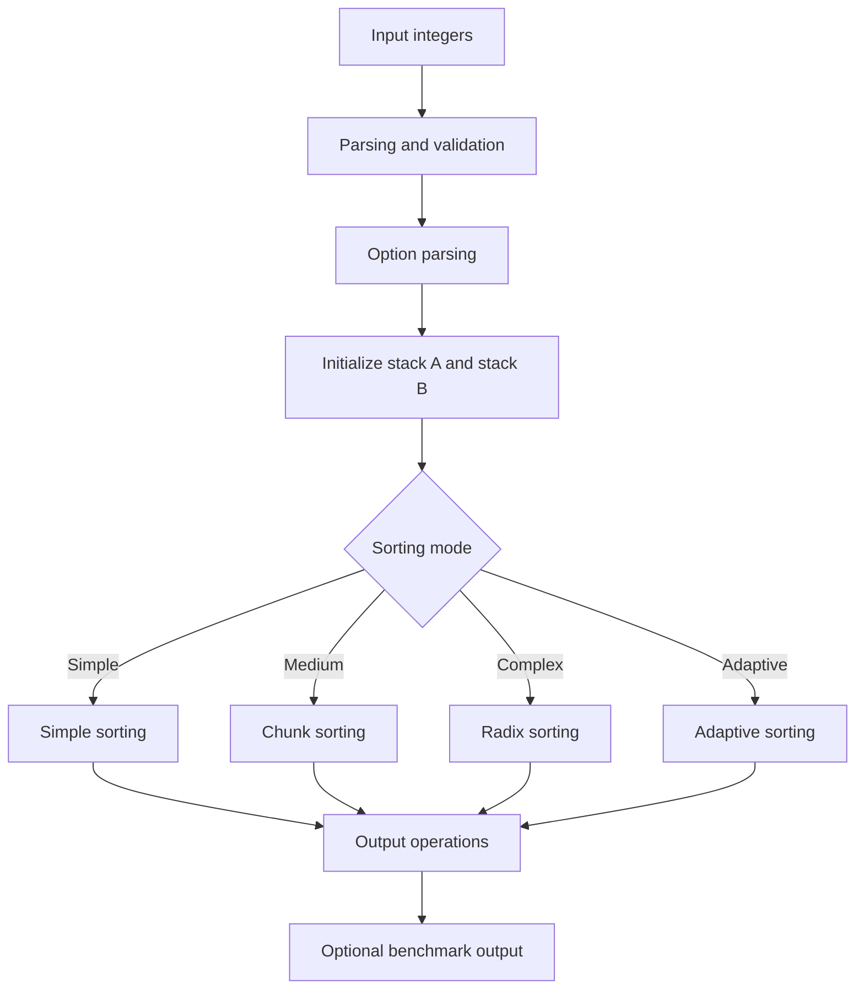

*This project has been created as part of the 42 curriculum by mirelsan and adedias-*

# Push Swap

## Description
Push Swap is a 42 project that challenges students to sort a list of integers using two stacks and a restricted set of operations. The program must generate the smallest possible sequence of instructions to transform the input into a sorted order.

The purpose of this project is to combine algorithm design, stack manipulation, and performance analysis. It focuses on building an efficient solution for different input sizes while respecting the rules of the game and the limitations of the available operations.

## Project Goal
The main objective is to sort a stack using only a predefined set of movements such as swap, push, rotate, and reverse rotate. The resulting instruction list should be correct, readable, and as short as possible.

## How It Works
The program receives a list of integers as input, validates it, initializes two stacks, and then applies a sorting strategy based on the selected mode.

The implementation includes four strategies:
- Simple mode: a direct approach for small inputs.
- Medium mode: a chunk-based approach for larger inputs.
- Complex mode: a radix-based strategy.
- Adaptive mode: automatically chooses the most suitable strategy depending on the input size and structure.

## Project Structure
The main logic is organized around these areas:
- Parsing and validation: verifies the input and rejects invalid data.
- Stack operations: performs swaps, pushes, rotations, and reverse rotations.
- Sorting strategies: implements the different algorithms used to solve the problem.
- Options and benchmarking: allows mode selection and optional performance output.

## Instructions
### Compilation
From the project directory, run:

```bash
cd 04_push_swap
make
```

This will generate the executable named push_swap.

### Execution
Run the program with a list of integers:

```bash
./push_swap 2 1 3 6 5 8
```

The program prints a sequence of operations that sorts the stack.

### Available Options
- --simple: uses the simple sorting approach
- --medium: uses the chunk-based approach
- --complex: uses the radix approach
- --adaptive: uses the adaptive strategy (default)
- --bench: prints a benchmark summary

### Cleaning
```bash
make clean
make fclean
```

## Flow Diagram


## Contributors
- adedias-: implemented the movement operations, the main sorting algorithm, the radix algorithm, and the adaptive algorithm.
- mirelsan: implemented parsing, benchmark output, the chunk-based sorting algorithm, validation, options handling, disorder detection, and the main program flow.
- Both collaborators debugged issues together, solved problems collaboratively, and tested the code as a team.

## Resources
- 42 Push Swap subject and project guidelines
- Classic references about stack sorting and radix sort
- Tutorials and explanations about chunk-based sorting strategies
- AI usage: AI tools were used to support algorithm understanding, debug edge cases, review code structure, and improve the clarity of the implementation. The core logic, algorithms, and final decisions were developed and validated by the team.

## Notes
The program expects valid integer input without duplicates and handles invalid input by displaying an error message.
